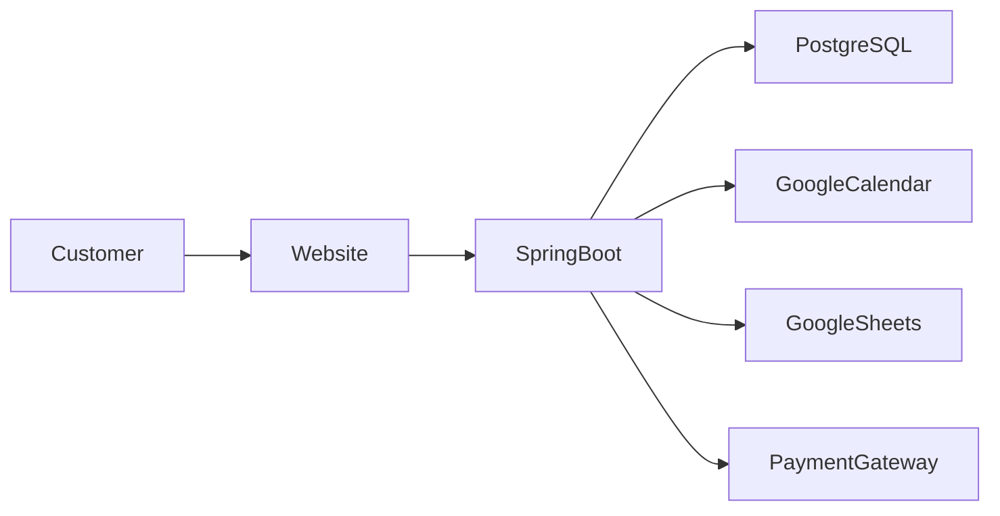
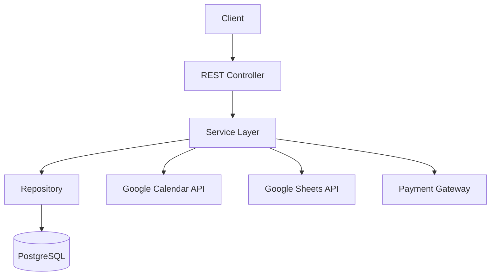
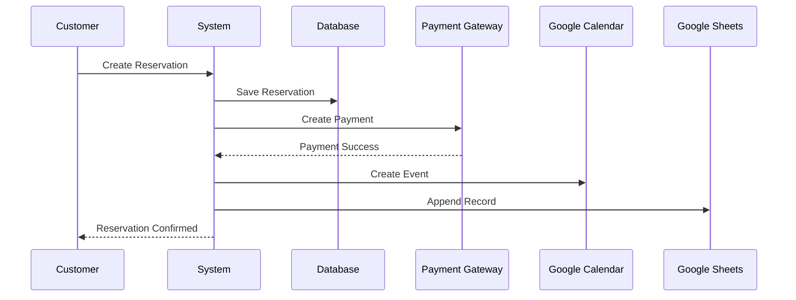
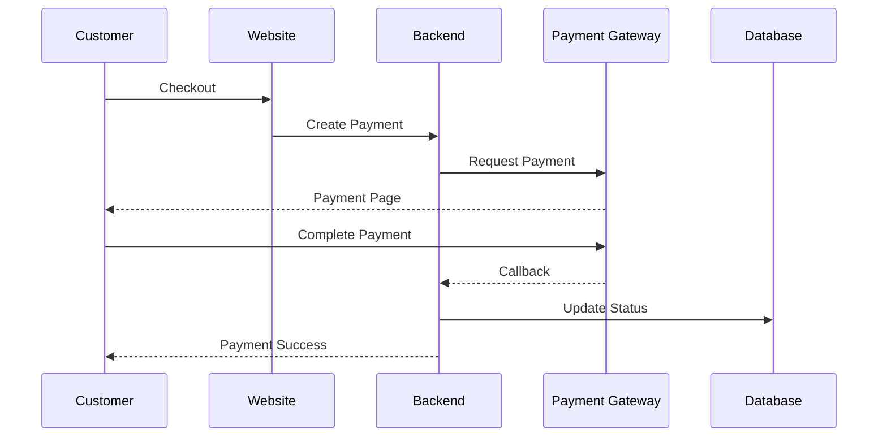
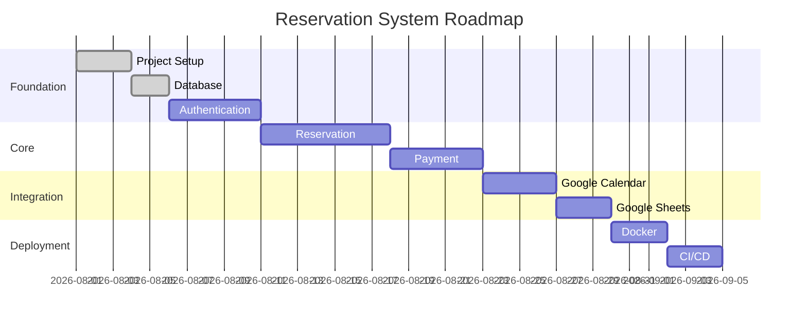

---

# 📸 System Preview

> UI akan dikembangkan pada tahap berikutnya. Berikut adalah gambaran alur sistem.



---

# 🏛 System Architecture



---

# 🧩 Clean Architecture

```
Controller
    │
    ▼
Service
    │
    ▼
Repository
    │
    ▼
Database
```

Additional Layers

```
Security

↓

Validation

↓

Exception Handler

↓

DTO Mapper
```

---

# 🗂 Project Modules

| Module | Description | Status |
|---------|-------------|--------|
| Authentication | Login & JWT | 🚧 |
| User | User Management | 🚧 |
| Reservation | Reservation Module | 🚧 |
| Payment | Payment Gateway | 🚧 |
| Calendar | Google Calendar Sync | 🚧 |
| Sheets | Google Sheets Export | 🚧 |
| Dashboard | Reporting Dashboard | 🚧 |

---

# 📅 Reservation Workflow



---

# 💳 Payment Flow



---

# 📅 Google Calendar Synchronization

```
Reservation Created

↓

Create Calendar Event

↓

Update Calendar Event

↓

Delete Calendar Event

↓

Synchronize Changes
```

Future Enhancement

- Two-way Synchronization
- Automatic Conflict Detection
- Reminder Notification

---

# 📊 Google Sheets Export

```
Reservation

↓

Generate Report

↓

Append Row

↓

Google Sheets
```

Export Fields

- Reservation ID
- Customer
- Reservation Date
- Reservation Time
- Payment Status
- Total Amount

---

# 🗃 Database Design

```
users

reservations

payments

reservation_logs

calendar_sync

sheet_exports
```

Entity Relationship Diagram tersedia di:

```
docs/erd.md
```

---

# 📈 Development Timeline



---

# 🛡 Security Features

- JWT Authentication
- BCrypt Password Encryption
- Role-Based Authorization
- Request Validation
- SQL Injection Prevention
- XSS Protection
- CSRF Protection
- Global Exception Handling

---

# 📦 Planned Integrations

| Service | Purpose |
|----------|---------|
| Google Calendar API | Reservation Scheduling |
| Google Sheets API | Reporting |
| Midtrans / Xendit / DOKU | Payment Gateway |
| Gmail API | Email Notification |
| Docker | Deployment |
| GitHub Actions | CI/CD |

---

# 🧪 Testing Strategy

| Test | Status |
|------|--------|
| Unit Test | ⏳ |
| Integration Test | ⏳ |
| Repository Test | ⏳ |
| Service Test | ⏳ |
| API Test | ⏳ |

Framework

- JUnit 5
- Mockito
- Spring Boot Test

---

# 📚 Coding Standards

Project mengikuti standar:

- Clean Code
- SOLID Principle
- RESTful API
- Layered Architecture
- Conventional Commit
- Git Flow
- Java Code Convention

---

# 📖 Documentation

| Document | Description |
|----------|-------------|
| architecture.md | System Architecture |
| erd.md | Entity Relationship Diagram |
| roadmap.md | Project Roadmap |
| api.md | API Specification |
| deployment.md | Deployment Guide |
| coding-standard.md | Coding Guidelines |

---

# ⭐ Future Enhancements

- Multi Branch Support
- Reservation Reminder
- Email Notification
- WhatsApp Notification
- Dashboard Analytics
- QR Code Check-in
- Customer Loyalty Program
- AI-based Reservation Prediction

---