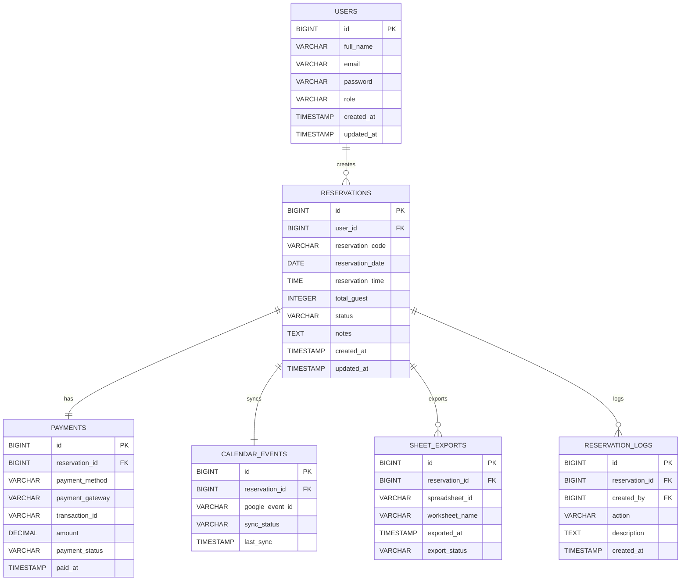

# Entity Relationship Diagram (ERD)

## Reservation Management System

Version: 1.0.0

---

# Overview

Dokumen ini menjelaskan struktur database Reservation Management System.

Database menggunakan:

- PostgreSQL
- Flyway Migration
- Snake Case Naming Convention
- UUID Ready (Future Enhancement)

---

# Design Principles

- Third Normal Form (3NF)
- Audit Trail
- Soft Delete Ready
- Foreign Key Constraint
- Enterprise Ready

---

# Entity List

| Entity | Description |
|---------|-------------|
| users | User Management |
| reservations | Reservation Data |
| payments | Payment Information |
| calendar_events | Google Calendar Synchronization |
| sheet_exports | Google Sheets Export History |
| reservation_logs | Reservation Activity Log |

---

# Entity Relationship

```text
Users
│
├──< Reservations
│        │
│        ├── Payment
│        │
│        ├── Calendar Event
│        │
│        ├── Sheet Export
│        │
│        └── Reservation Logs
```

---

# users

Description

Menyimpan seluruh akun pengguna.

Columns

| Column | Type | Constraint |
|---------|------|------------|
| id | BIGSERIAL | PK |
| full_name | VARCHAR(100) | NOT NULL |
| email | VARCHAR(150) | UNIQUE |
| password | VARCHAR(255) | NOT NULL |
| role | VARCHAR(20) | ADMIN / STAFF / CUSTOMER |
| created_at | TIMESTAMP | |
| updated_at | TIMESTAMP | |

Relationship

```
1 User

↓

Many Reservations
```

---

# reservations

Description

Data reservasi pelanggan.

Columns

| Column | Type |
|---------|------|
| id | BIGSERIAL |
| user_id | BIGINT FK |
| reservation_code | VARCHAR(30) UNIQUE |
| reservation_date | DATE |
| reservation_time | TIME |
| total_guest | INTEGER |
| status | VARCHAR(30) |
| notes | TEXT |
| created_at | TIMESTAMP |
| updated_at | TIMESTAMP |

Status

```
PENDING

CONFIRMED

PAID

CANCELLED

COMPLETED
```

Relationship

```
Reservation

↓

belongs to User

↓

has one Payment

↓

has one Calendar Event

↓

has many Reservation Logs
```

---

# payments

Description

Informasi pembayaran.

Columns

| Column | Type |
|---------|------|
| id | BIGSERIAL |
| reservation_id | BIGINT FK |
| payment_method | VARCHAR(30) |
| payment_gateway | VARCHAR(30) |
| transaction_id | VARCHAR(100) |
| amount | DECIMAL |
| payment_status | VARCHAR(30) |
| paid_at | TIMESTAMP |
| created_at | TIMESTAMP |

Status

```
WAITING

SUCCESS

FAILED

EXPIRED

REFUNDED
```

---

# calendar_events

Description

Sinkronisasi Google Calendar.

Columns

| Column | Type |
|---------|------|
| id | BIGSERIAL |
| reservation_id | BIGINT FK |
| google_event_id | VARCHAR(200) |
| sync_status | VARCHAR(30) |
| last_sync | TIMESTAMP |
| created_at | TIMESTAMP |

Status

```
PENDING

SYNCED

FAILED
```

---

# sheet_exports

Description

Riwayat export Google Sheets.

Columns

| Column | Type |
|---------|------|
| id | BIGSERIAL |
| reservation_id | BIGINT FK |
| spreadsheet_id | VARCHAR(200) |
| worksheet_name | VARCHAR(100) |
| exported_at | TIMESTAMP |
| export_status | VARCHAR(30) |

---

# reservation_logs

Description

Audit aktivitas reservasi.

Columns

| Column | Type |
|---------|------|
| id | BIGSERIAL |
| reservation_id | BIGINT FK |
| action | VARCHAR(50) |
| description | TEXT |
| created_by | BIGINT FK |
| created_at | TIMESTAMP |

Contoh Action

```
CREATE

UPDATE

PAYMENT_SUCCESS

PAYMENT_FAILED

CALENDAR_SYNC

EXPORT_SHEET

CANCEL

CHECK_IN

CHECK_OUT
```

---

# Relationship Cardinality

```text
users

1 ------ * reservations

reservations

1 ------ 1 payments

reservations

1 ------ 1 calendar_events

reservations

1 ------ * reservation_logs

reservations

1 ------ * sheet_exports
```

---

# Mermaid ER Diagram



---

# Index Recommendation

```
users.email

reservations.user_id

reservations.reservation_date

reservations.status

payments.transaction_id

payments.payment_status

calendar_events.google_event_id
```

---

# Naming Convention

Tables

```
snake_case
plural
```

Examples

```
users

payments

calendar_events

reservation_logs
```

Columns

```
created_at

updated_at

reservation_date

payment_status
```

---

# Future Enhancement

Planned entities

```
roles

permissions

refresh_tokens

notifications

branches

rooms

tables

business_hours

holidays

attachments

audit_logs
```

---

# Database Version

Current Version

```
v1.0.0
```

Managed By

```
Flyway Migration
```